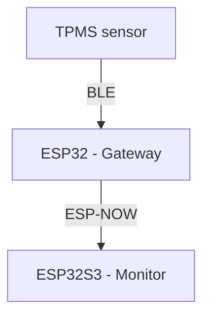

# ESP32 BLE TPMS

This repository contains source files for building a ESP32-based TPMS system with Chinese BLE TPMS sensors

## Architecture

The system consists of a ESP32-S3 LCD board (Monitor) for displaying information, a ESP32 classic (Gateway) for reading the TPMS sensors and the sensors themselves. Two ESP32s are necessary because it appears that (some) ESP32-S3 LCD boards have very poor Bluetooth connectivity (presumably because of the antenna is hidden under the screen).

## BLE protocol

The Chinese LEEPEE BLE TPMS sensors publish their readings inside BLE advertisment packages (byte numbers are 0-based):
 - bytes 17-20 (little-endian): pressure in Pascals
 - bytes 21-22 (little-endian): temperature (signed) in 1/100s deg Celsius
 - bytes 14-16: unique part of the address (bytes 11-13 are common to all sensors)

## ESP-NOW protocol

[ESP-NOW](https://www.espressif.com/en/solutions/low-power-solutions/esp-now) is a protocol that allows direct communication between devices using WiFi. The Gateway sends data ESP-NOW packets to the Monitor:
 - every 5 seconds it sends a 1-byte `ping` message
 - whenever TPMS sensor advertisment message is received, a ESP-NOW packet (defined [here](/src/Monitor/tpms_data.hpp)) is sent containsing the sensor ID and temperature and pressure readings.

## Sensor IDs

Each sensor appears to have 3-byte unique ID. This ID is also part of its name. Here's the screenshot of the dedicated iPhone app:

In the [Nordic Semiconductor](https://www.nordicsemi.com/) excelent nRF app sensor `233111` appears under the name `TPMS2_233111`. The acual advertisment data received is:

| LEN | TYPE | VALUE |
|-----|------|-------|
| 2   | 0x01 | 0x05 |
| 3   | 0x03 | 0xB0FB |
| 19  | 0xFF | 0x000181EACA233111CDD80300FD0800005F00 |
| 13  | 0x09 | 0x54504D53325F323333313131 |

The last field (type `0x09`) is the name as it appears in nRF: `TPMS2_233111`, ASCII-encoded. The most interesting part is the `0xFF` field. Bytes 7-9 (0-based) of this field contain the same number as the name (233111) but this time not encoded as ACCII characters but as a 24-bit value. The most significant digit encodes the intendet sensor position:
- 1 - front left
- 2 - front right
- 3 - rear left
- 4 - rear right
The remaining 5 digits appear to form a unique ID of the sensor. 
The next 4 bytes of this field, 10-13 (0-based), contains the pressure value in Pascals. The next 2 bytes contains the signed 16-bit integer containing temperature in 1/100 of a degree Celsius.
